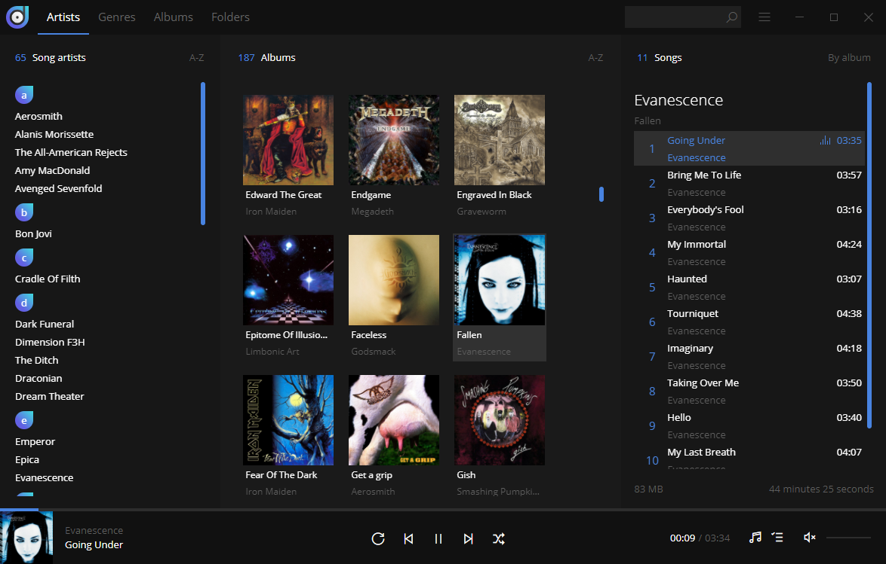

# Dopamine

Dopamine is an elegant audio player which tries to make organizing and listening to music as simple and pretty as possible. This version is written using Electron, Angular and Typescript. The original Dopamine (for Windows), which is written in WPF and C#, remains available <a href="https://github.com/digimezzo/dopamine-windows">here</a>.

Dopamine icons created by <a href="https://www.itssharl.ee/">Sharlee</a>.

[](https://github.com/digimezzo/dopamine/releases/latest)
[](https://github.com/digimezzo/dopamine/actions/workflows/nightly.yml)
[](https://github.com/digimezzo/dopamine/issues)
[](https://www.paypal.com/cgi-bin/webscr?cmd=_s-xclick&hosted_button_id=MQALEWTEZ7HX8)

<a href='https://ko-fi.com/S6S11K63U' target='_blank'></a>



## Build prerequisites

-   rpm: required to build rpm package
-   libarchive-tools: contains bsdtar, which is required to build pacman package.

**Build prerequisites on Ubuntu:**

-   Install Node.js LTS
-   Install Visual Studio Code
-   Install rpm (required to build rpm package) and libarchive-tools (contains bsdtar, which is required to build pacman package): `sudo apt install rpm libarchive-tools`

Follow the build instructions below to start or build Dopamine for your platform.

**Build prerequisites on Manjaro:**

-   Install Node.js LTS:
    -   `yay -S nvm`
    -   `nvm install 14`
-   Install Visual Studio Code: `yay -S visual-studio-code-bin`
-   Install rpm (required to build rpm package): `sudo pacman -S rpm-tools`

Follow the build instructions below to start or build Dopamine for your platform.

**Build prerequisites on Windows:**

-   Download and install Node.js LTS from https://nodejs.org (During the installation, select all features and check the box to install **Tools for Native Modules**).
-   After the installation of Node.js, restart computer to ensure that npm is added to the path.
-   Download and install Visual Studio Code from https://code.visualstudio.com/
-   Download the Dopamine source code
-   Open Visual Studio Code and open the "dopamine" folder (the folder containing package.json)

Follow the build instructions below to start or build Dopamine for your platform.

**Build prerequisites on MacOS:**

-   Install Node.js LTS from https://nodejs.org (During the installation, select all features and check the box to install Tools for Native Modules).
-   Make sure npm is accessible via the console
    -   Press command + space and search for console
    -   Write `npm --v` and press enter, this should give you the version number if npm is properly installed.
-   Download and install Visual Studio Code from https://code.visualstudio.com/
-   Download the Dopamine source code
-   Open Visual Studio Code and open the "dopamine" folder (the folder containing package.json)

## Build instructions

Due to the native dependency better-sqlite3, this project cannot be built for all platforms on GNU/Linux. The GNU/Linux packages must be built on GNU/Linux, the Windows package must be built on Windows and the MacOS package must be built on MacOS.

```bash
$ git clone https://github.com/digimezzo/dopamine.git
$ cd dopamine
$ npm install                # Install dependencies
$ npm start                  # Start Dopamine
$ npm run electron:windows   # Build for Windows
$ npm run electron:linux     # Build for Linux
$ npm run electron:mac       # Build for Mac
```

## Pacman installation notes

The pacman package can be installed using this command (replace x.y.z with the correct version number):

`$ sudo pacman -U Dopamine-x.y.z.pacman`

If you're getting an error concerning a missing package libappindicator-sharp, use this command to perform the installation instead (replace x.y.z with the correct version number):

`$ sudo pacman -U Dopamine-x.y.z.pacman --assume-installed libappindicator-sharp`
